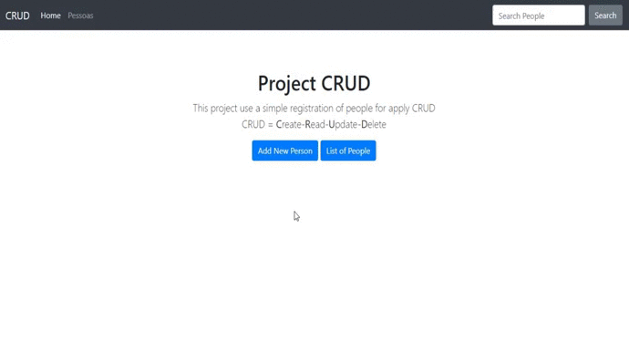

<h1 align="center">
 
  PROJECT CRUD
 
 
</h1>

This project use a simple registration of people for apply CRUD  
        

  

[//]: # (Add your gifs/images here:)

  

## Features
[//]: # (Add the features of your project here:)
This app features all the latest tools and practices in mobile development!

- 💹 **Node Js** — A web framework for Node Js
- 📄 **MySql** — A database

## Getting started

Run npm to install dependecies 
Run npm start for start the app 

## License

This project is licensed under the MIT License - see the [LICENSE](https://opensource.org/licenses/MIT) page for details.
